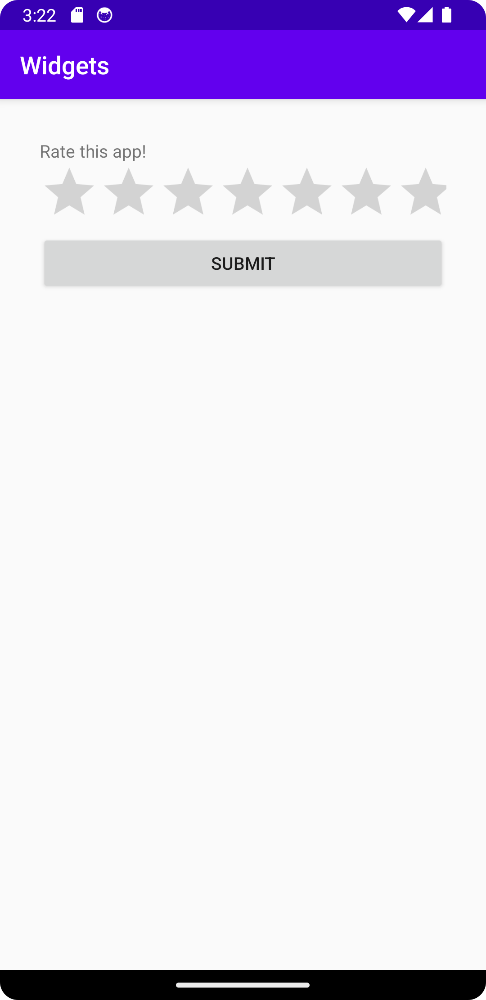

# Report

1. Chose linear layout as main layout (vertical)
2. Added 32 dp margin on the layout so it centers nicely
3. Added three widgets: text, ratingBar and a button
4. Arranged the widgets and modified attributes so it looks okay
5. Made an xml resource for each widget's text

## Code 

1. Linear Layout
```xml
<LinearLayout
    android:orientation="vertical"
>
```

2. positioning
```xml
<LinearLayout
    android:layout_width="match_parent"
    android:layout_height="match_parent"
    android:layout_marginStart="32dp"
    android:layout_marginLeft="32dp"
    android:layout_marginTop="32dp"
    android:layout_marginEnd="32dp"
    android:layout_marginRight="32dp"
    android:layout_marginBottom="32dp"
>
```

3. Widgets

```xml
<TextView/>
<RatingBar/>
<Button/>
```
4. Widget Attributes

```xml
<TextView
    android:id="@+id/textView"
    android:layout_width="match_parent"
    android:layout_height="wrap_content"
    android:fontFamily="sans-serif"
    android:text="@string/field_content" />

<RatingBar
    android:id="@+id/ratingBar"
    android:layout_width="match_parent"
    android:layout_height="wrap_content" />

<Button
    android:id="@+id/button"
    android:layout_width="match_parent"
    android:layout_height="wrap_content"
    android:text="@string/button_name" />
```

5. XML resource
```xml
<resources>
    <string name="app_name">Widgets</string>
    <string name="button_name">submit</string>
    <string name="field_content">Rate this app!</string>
</resources>
```

## IMG 

 


